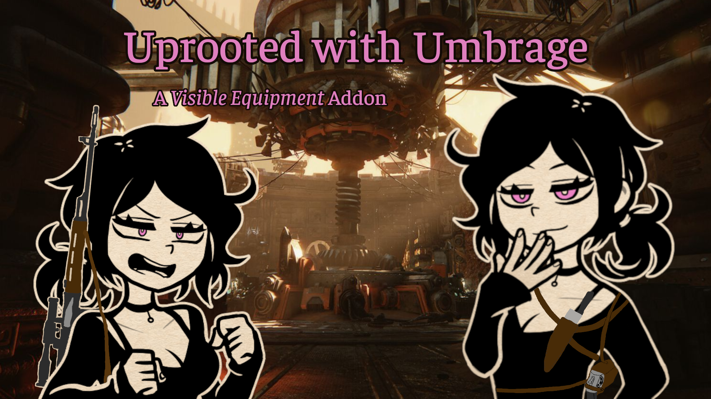

# Visible Equipment - Uprooted with Umbrage

Addon for the Standalone Visible Equipment mod for *Warhammer 40,000: Darktide*.

Adds weapon placements that I think are cool. Mostly tactical and shitposty. 

## Requirements
- Darktide prepared for modding
    - DML/DMF (see linked guide in installation)
    - Not played through cloud gaming services
- Visible Equipment
    - Currently not on Nexus. WIP in the [Darktide Modders Discord](https://discord.gg/rKYWtaDx4D), pinned in the `#weapon-customiation-mod` channel
    - It does not require Extended Weapon Customization

### Installation 

Install like any other mod. If you don't know how, here is a [guide for manual mod installation](https://dmf-docs.darkti.de/#/installing-mods)

Load order does not matter.

## Weapon Placements
Placements may have a descriptive tag that is *italicized*. Explanations for these are in the glossary below.
- Chest Pistol: `uwu_chest_pistol`
    - On the right side of the upper chest, pointing away from the right shoulder
    - *For pistols*
- Chest Pistol (Sinister): `uwu_chest_pistol_sinister`
    - On the upper chest, pointing away from the left shoulder
    - *For pistols*
    - *Sinister*
- Shoulder Holster: `uwu_under_left_arm`
    - Under the left armpit, pointing to the back
    - *For pistols*
- Shoulder Holster (Sinister): `uwu_under_right_arm`
    - Under the right armpit, pointing to the back
    - *For pistols*
    - *Sinister*
- Chest Middle: `uwu_chest_middle`
    - On the stomach, facing down and away from the right shoulder
    - Added to all weapons, but only really fits on ranged weapon (not staff)
- Prison Pocket: `uwu_butt`
    - Up the butt
    - only really fits on melee/staffs
    - *xd*
- Prison Pocket (Flipped): `uwu_butt_flip`
    - Up the butt (flipped)
    - only really fits on melee/staffs
    - *xd*
- Thigh Drop Holsters: `uwu_thigh_drop` 
    - On right and left thighs respectively, pointing straight down
    - *Same-side draw*
    - *For pistols*
    - *Sinister*: `uwu_thigh_drop_sinister`
- Ankle Holsters
    - *Same-side draw*
    - *For pistols*: 
        - `uwu_right_ankle_pistol`, `uwu_right_ankle_inside_pistol`
        - *Sinister*: `uwu_left_ankle_pistol`, `uwu_left_ankle_inside_pistol`
        - Pistol grips facing the back, on the outside and on the inside of the leg
    - *For knives*: 
        - `uwu_right_ankle`, `uwu_right_ankle_inside`
        - *Sinister*: `uwu_left_ankle`, `uwu_left_ankle_inside`
        - Blade facing down, on the outside and on the inside of the leg
- Forehead: `uwu_forehead`
    - Weapon on forehead, with the left-hand weapon being behind the head
    - Includes a variant where the weapons are half the size. Forehead (Shrink): `uwu_forehead_shrink`
    - *xd*

## Glossary
- *For pistols*: Placement is only added to weapons with "pistol" or "revolver" in the internal name
- *For knives*: Placement is only added to wepaons with "knife" or "shivs" in the internal name
- *Sinister*: Placement is designed for the weapon to be drawn with the left hand
- *Same-side draw*: Placement is designed for the weapon to be drawn by the hand on the same side of the body, without crossing over
- *xd*: Placement requires "xd mode" to be enabled in the Mod Options to appear

## Known Issues
- Positions are not localized
    - This requires the base mod to be updated, likely after `extended_weapon_customization` is done
    - They'll use the `<code_names>` for now
- Positions clip into body or float too far off
    - Positions are set regardless of cosmetics equipped, so thicker jackets and such would clip, while slimmer clothes may make the weapons float
    - Will likely make variants that stick out a bit more
- Weapon position doesn't make sense at all
    - Report the really egregious ones and I'll put them on the list
    - Mainly for the `butt` positions
    - Fixing this I'll have to add a check to every gun and I'm not doing ALL that right now
    - Also I didn't check anything for Ogryn so lol
- Camera previews are inaccurate (just the head)
    - Yeah idk what's going on here atm
    - May just be a base mod issue